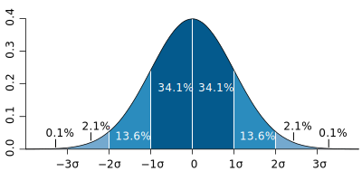
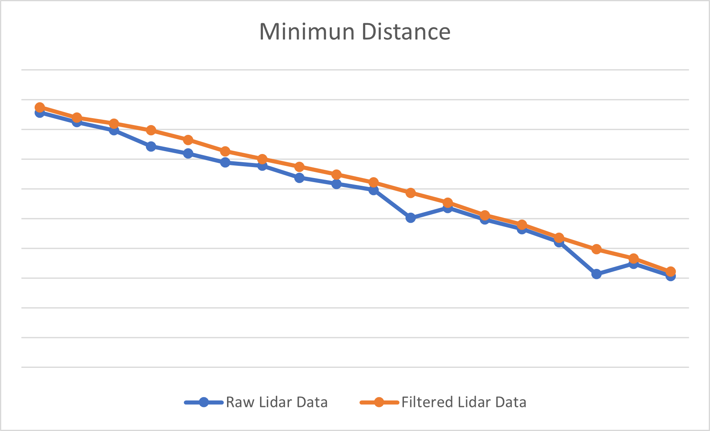
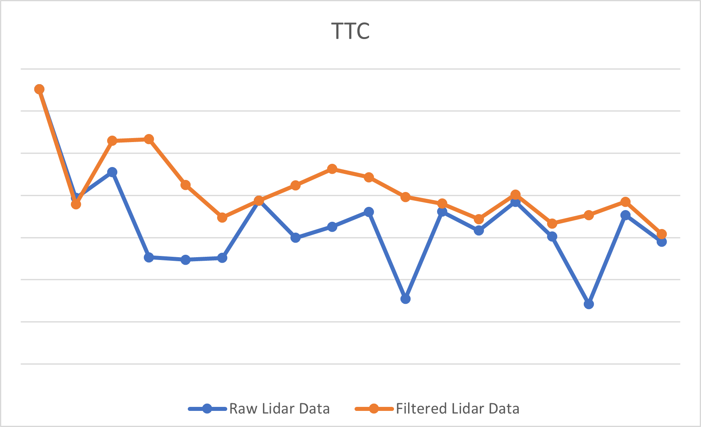
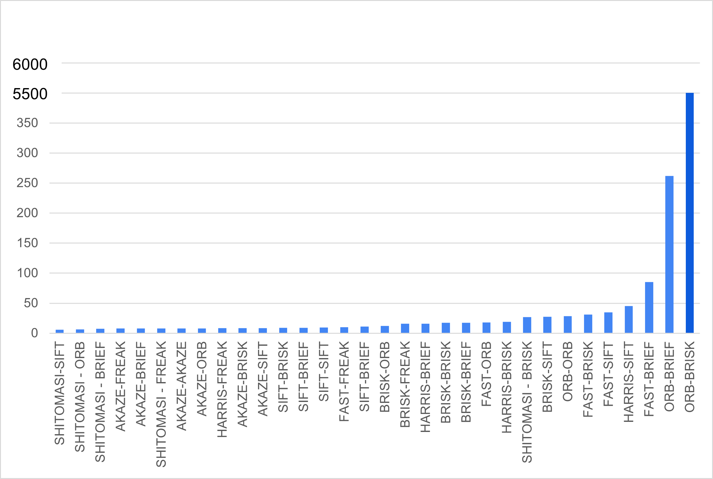

# SFND 3D Object Tracking

## Dependencies for Running Locally
* cmake >= 2.8
  * All OSes: [click here for installation instructions](https://cmake.org/install/)
* make >= 4.1 (Linux, Mac), 3.81 (Windows)
  * Linux: make is installed by default on most Linux distros
  * Mac: [install Xcode command line tools to get make](https://developer.apple.com/xcode/features/)
  * Windows: [Click here for installation instructions](http://gnuwin32.sourceforge.net/packages/make.htm)
* Git LFS
  * Weight files are handled using [LFS](https://git-lfs.github.com/)
  * Install Git LFS before cloning this Repo.
* OpenCV >= 4.1
  * This must be compiled from source using the `-D OPENCV_ENABLE_NONFREE=ON` cmake flag for testing the SIFT and SURF detectors.
  * The OpenCV 4.1.0 source code can be found [here](https://github.com/opencv/opencv/tree/4.1.0)
* gcc/g++ >= 5.4
  * Linux: gcc / g++ is installed by default on most Linux distros
  * Mac: same deal as make - [install Xcode command line tools](https://developer.apple.com/xcode/features/)
  * Windows: recommend using [MinGW](http://www.mingw.org/)

## Basic Build Instructions

1. Clone this repo.
2. Make a build directory in the top level project directory: `mkdir build && cd build`
3. Compile: `cmake .. && make`
4. Run it: `./3D_object_tracking`.

## Rubic

### FP.1 Match 3D Objects
> Implement the method "matchBoundingBoxes", which takes as input both the previous and the current data frames and provides as output the ids of the matched regions of interest (i.e. the boxID property). Matches must be the ones with the highest number of keypoint correspondences.

1. Use matches to find the links between bounding boxes in previous and current frame
2. Consider a point could fall in multiple bounding boxes, use a 2D array to count how
   many points fall in previous and current frames bounding boxes
3. Pick pairs in each row with highest scores

### FP.2 Compute Lidar-based TTC
>Compute the time-to-collision in second for all matched 3D objects using only Lidar measurements from the matched bounding boxes between current and previous frame.</b>  

<b> Normal Distribution</b>  

  

[Wiki](https://en.wikipedia.org/wiki/Normal_distribution) 

Use the normal distribution Oto filter out outliers. To identify outliers using the normal distribution, we can use the standard deviation, which measures how much the values vary from the mean.
A common rule of thumb is to consider any value that is more than three standard deviations away from the mean as an outlier.

By removing these outliers, we can reduce the noise and improve the accuracy of our analysis.

### FP.3 Associate Keypoint Correspondences with Bounding Boxes
> Prepare the TTC computation based on camera measurements by associating keypoint correspondences to the bounding boxes which enclose them. All matches which satisfy this condition must be added to a vector in the respective bounding box.

1. Loop through the matched points and check if they are inside the bounding box
2. Log the points that are inside the bounding box and compute their distance
3. Set a distance threshold based on the mean distance value, for example 1.2 times the mean distance value
4. Loop through the points logged in step 1 and add them to the bounding box keypoints if their distance is lower than the threshold

### FP.4 Compute Camera-based TTC
>Compute the time-to-collision in second for all matched 3D objects using only keypoint correspondences from the matched bounding boxes between current and previous frame.
1. Loop through the matches from task 3 to get keypoints in both frames
2. Compute and store the distance ratio 
3. Use the median distance ration to get TTC

### FP.5 Performance Evaluation 1
> Find examples where the TTC estimate of the Lidar sensor does not seem plausible. Describe your observations and provide a sound argumentation why you think this happened.</b>  

[csv](images/fp5.csv)

|Data\Frame| 0 - 1 | 1 - 2 | 2 - 3 | 3 - 4 | 4 - 5 | 5 - 6 | 6 - 7 | 7 - 8 | 8 - 9 | 9 - 10|10 - 11|11 - 12|12 - 13|13 - 14|14 - 15|15 - 16|16 - 17|17 - 18| 
|:---      |:---   |:---   |:---   |:---   |:---   |:---   |:---   |:---   |:---   |:---   |:---   |:---   |:---   |:---   |:---   |:---   |:---   |:---   |
|Raw data mindistance |7.913  |7.849  |7.793  |7.685  |7.638  |7.577  |7.555  |7.475  |7.434  |7.393  |7.205  |7.272  |7.194  |7.129  |7.042  |6.827  |6.896  |6.814  |
|Filtered min distance |7.949  |7.879  |7.839  |7.794  |7.729  |7.653  |7.601  |7.549  |7.496  |7.443  |7.373  |7.308  |7.222  |7.159  |7.072  |6.994  |6.932  |6.843  |
|Raw TTC   |13.03  |7.879  |9.115  |5.061  |4.954  |5.034  |7.756  |5.991  |6.518  |7.226  |3.097  |7.235  |6.335  |7.697  |6.044  |2.854  |7.073  |5.799  |
|Filtered TTC|13.03|7.575  |10.59  |10.67  |8.493  |6.957  |7.756  |8.482  |9.254  |8.860  |7.927  |7.612  |6.878  |8.043  |6.671  |7.064  |7.702  |6.164  |

At fram 10-11 and 15-16, the raw Lidar base TTC seem not plausible, this could be due to two factors. One factor is the noise in the Lidar data, which can cause outliers and affect the estimation of the closest point. Normal distribution is used to eliminate outliers in data analysis. The image below shows the lidar points before and after filtered using this method. 

 

<b>Left:</b> raw lidar points &nbsp;&nbsp;&nbsp;&nbsp;&nbsp; <b>Right:</b> filtered lidar points  

Another factor is the constant velocity model, it assume the objecte is at constant speed. When the velocity of an object changes abruptly, it can cause errors in the tracking algorithm, which assumes a smooth and continuous motion. This can lead to incorrect predictions of the object's future position and can result in tracking failures.

### FP.6 Performance Evaluation 2
<b>Run several detector / descriptor combinations and look at the differences in TTC estimation. Find out which methods perform best and also include several examples where camera-based TTC estimation is way off. As with Lidar, describe your observations again and also look into potential reasons. </b>

<b> Max Lidar and Camera TTC Difference (s) </b>

[CSV: Lidar and Camera TTC error in each frame](images/fp6.csv)

  

The top three detector descriptor combination are SHITOMASI-SIFT, SHITOMASI-ORB and SHITOMASI-BRIEF.
The key factor of calculating camera TTC is the matched key points. A bad key point matched could lead to unstable camera TTC estimation.
